

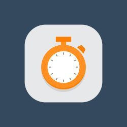

 

# Activity (Time) Tracker

---

 

## Description:
This application uses the [Ionic Framework 7](https://ionicframework.com/) and [VueJs 3](https://vuejs.org/). The purpose of this app is to keep track of the amount of time you have spent on certain activities. An activity could be anything like *jogging*, *hacking*, *reading*, *walking* and so on. You can keep track of any task/activity where you wanna have an overview of how much time you have spent within a given period. All the data which you enter gets stored locally on your device/browser. No cloud services are used.

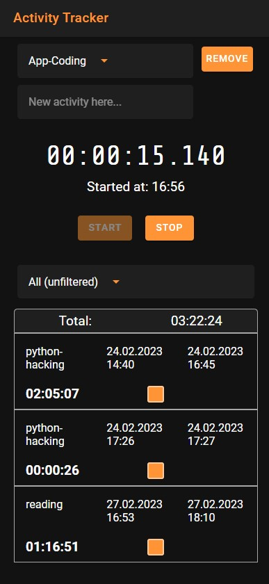

---

## User Journey

You're having the goal to learn some new hacking skills and you wanna track the amount of time you are spending on this activity.

1. Define a new activity i.e. *python-hacking*
2. Select the new defined activity
3. Start the timer if you are ready to go
4. Whenever you wanna stop the activity - just stop the timer
5. To keep an eye on how much time you have spent in a given time frame just select out of the following options:

    1. Today
    2. Yesterday
    3. This Week
    4. Last Week
    5. This Month
    6. Last Month
    7. This Year
    8. All
    9. All (unfiltered)
6. Watch the summed up time for your activity and be proud of your self ;-)

---

## App Features - Walkthrough

The app is offering a handful of features that might be extended in the future. Feel free to participate and add some more ;-)

---

### **1. Adding Of A New Activity**

Enter the name of a new activity into the input field and press *Add*. 

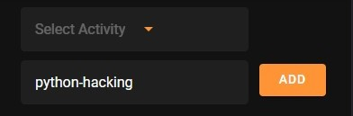

After a new activity was created you can select it from the *Activity Dropdown-List*.

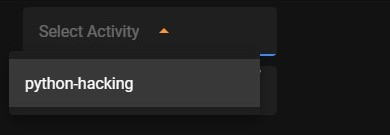

Defining a new activity is just the start. If you want to book some time on a given activity keep on reading.

**Note:** If an activity exists already the input field will show a warning message *Activity already exists*.

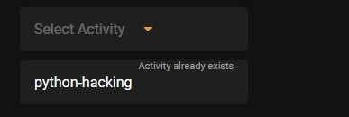

---

### **#2. Book Time For A Certain Activity**

To keep track of how much time you are spending on a certain activity you do the following steps:
1. Select the activity in the activity dropdown list 
2. Press *Start* - the time when your booking has been started will be shown underneath the timer.
3. Whenever you wanna stop the activity press *Stop*
4. The new time booking gets added to your list. 

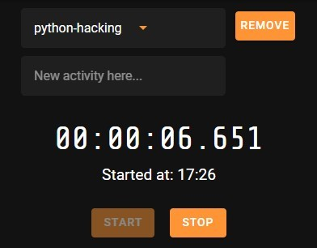

**Note:** Please mind the filtering option if you are missing some time bookings.

---

### **3. Removing Of An Existing Activity**
To remove an activity and all its time records just select the activity from the dropdown list and press *Remove*.

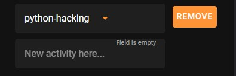

**Note:** This cannot be undone.

---

### **#4. Filtering**

To have an overview about how much time you have spent for a certain activity follow the next steps:
1. Select an activity in the activity dropdown list 
2. Depending on the selected time range you will see the summed up amount of time you have spent for this activity within the selected period.

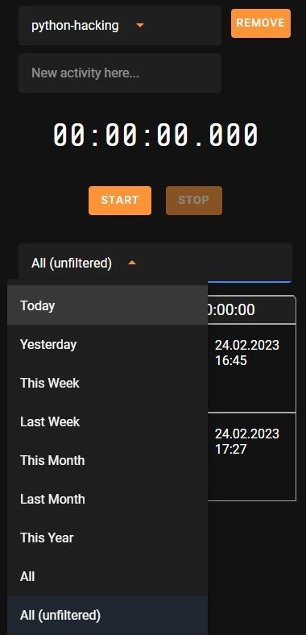

**Note #1:** You can use the time range *All (unfiltered)* without selecting an activity. The list will show all time recordings for all your activities you have done. 

**Note #2:** If you have no activity selected for all time range options except 'All (unfiltered)* you will get a warning message.

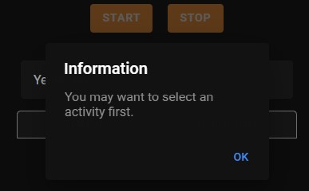

---

### **5. Delete a time booking**

If you want to delete one or multiple time bookings of a certain activity you have to do the following steps:

1. Select the activity in the activity dropdown list 
2. Apply the time filter
3. Mark the checkbox of  the entry you want to delete
4. Press the *Delete Selected Entries*

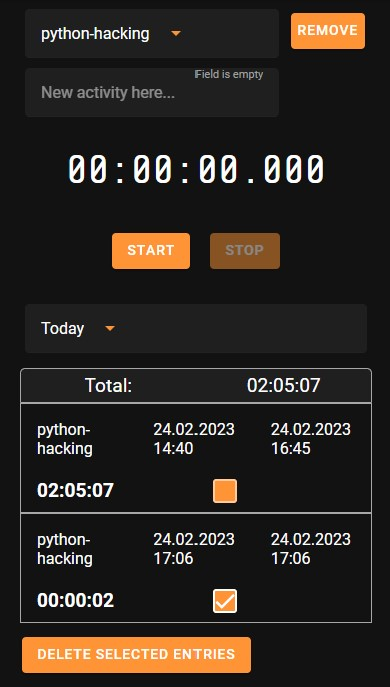

**Note:** You are only deleting the time booking(s) not the activity itself. Deleting a time booking cannot be undone.

---

### **6. Hidden mode: Factory Reset**
In case you want to remove all your activities and their corresponding time bookings you can reset the application to its default. Just click somewhere in the time field area (marked red in the below screenshot) and confirm the upcoming dialog with *OK*. 

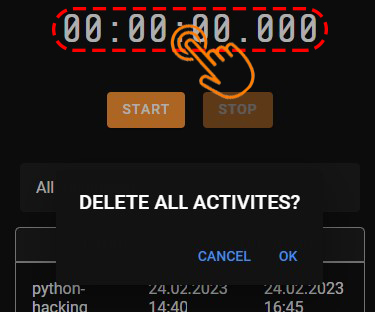

**Note:** This cannot be undone.

---

## How to get this app running ?
The fastest way to get the app running is probably on a PC. 

**Requirements:**
1. [NodeJS and npm](https://nodejs.org)
2. (OPTIONAL) An IDE or Editor if you wanna tweak the code i.e. [Visual Studio Code](https://code.visualstudio.com/)
3. If you are using Visual Studio Code I strongly recommend to install *Ionic* the *Official extension for Ionic and Capacitor development*   
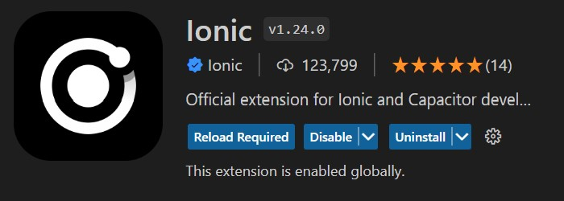
4. The [Ionic CLI](https://ionicframework.com/docs/intro/cli) 
5. If you plan to deploy this app on your Android Phone you have to install the [Android Studio](https://developer.android.com/studio)

**Installation Precedure:**
1. Clone/download the repo
2. npm install
3. ionic serve 
4. Browse to http://localhost:8100
5. For Android Deployment I recommend to install [Capacitor Android](https://capacitorjs.com/docs/android) and deploy the app via the Ionic Visual Studio Extension to Android Studio. From the Android Studio you can either run the app in a virtual environment or simply deploy it to your smartphone.

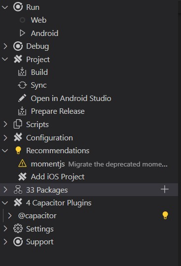

---

## Disclaimer - everything has a little one ;-)
This app is just a side project to get some hands-on experience in using the [Ionic Framework](https://ionicframework.com). This app is far away from being perfect but it works and I'm using it for keeping track of activities I'm working on. 

Using [@ionic/storage](https://github.com/ionic-team/ionic-storage) for storing the activities just as key/value entries works but could be improved with i.e. using a SQL-lite persistency layer or something similar.

Using [Pinia](https://pinia.vuejs.org/) as a central data store is also on the wishlist.

If you might find this app useful as an example [you decide if it is a good or a bad one ;-)] feel free to participate and add some new features. Tweak the UI or do whatever you think could need some improvements. 

---

## License
This app is based on the [MIT Licence](https://opensource.org/license/mit/).

---